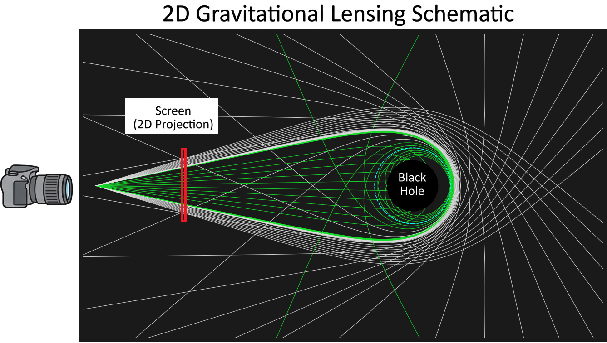
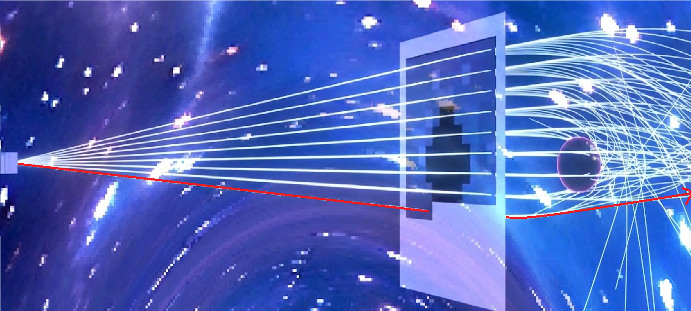
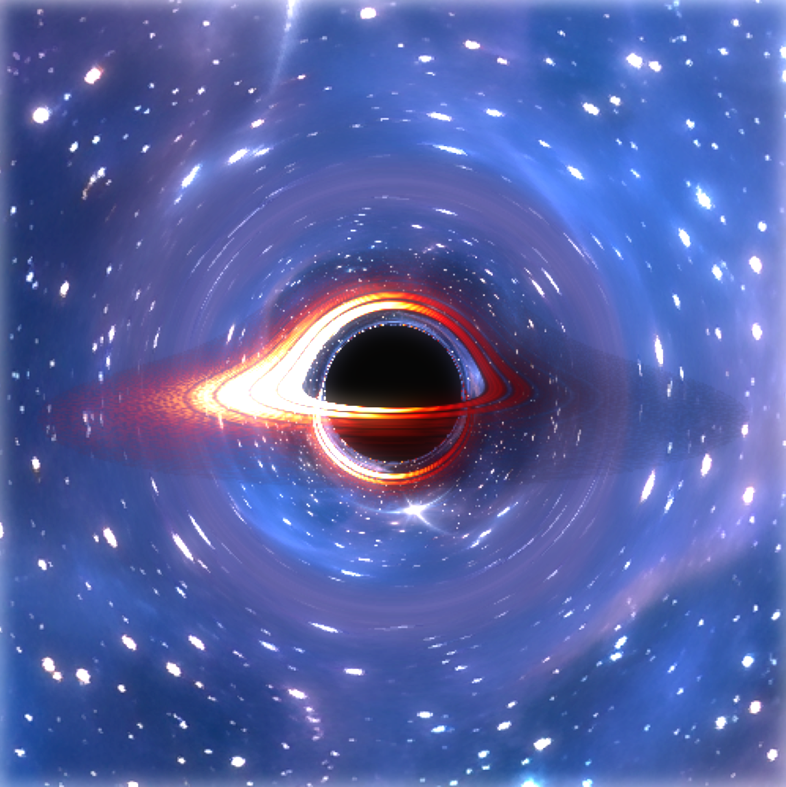
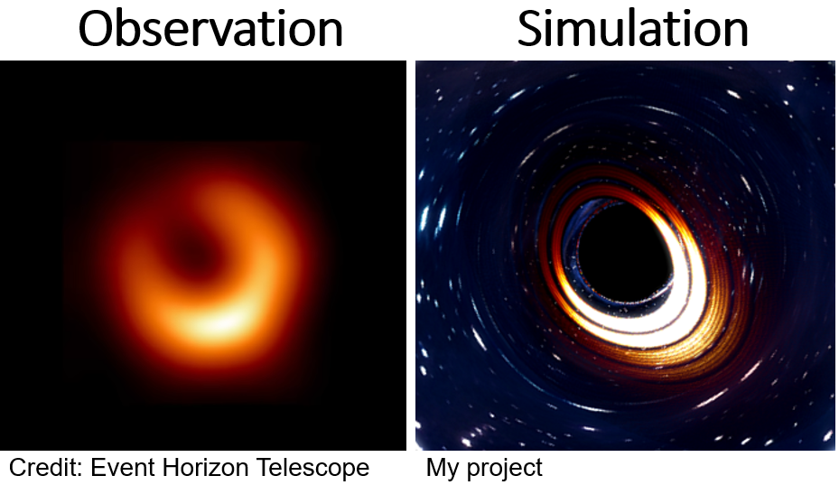

# Kerr Blackhole Simulation

廣義相對論黑洞渲染器。把愛因斯坦場方程轉化為電影級 3D 動畫。

## 方法解釋





專案輸出的圖片就會是我們從宇宙中看到的光線的匯集，也就是那個板，透過增加解析度可以模擬在有良好設備的情況下真實會觀察到的情況。

## 具體效果



這就是回輸出的圖片，我們可以自由調整攝影機的位置、角度、距離。


也可以做一些後製的調整。



最後當然是跟實際觀測到的黑動作比較，這個是從高仰角($~50^{\circ}$)看到的景象 (ゝ∀・)b

](https://www.youtube.com/watch?v=QjVldy41jws)

來看看解析度350*350的影片 🎈🎃🎁 

---

> **平台說明**：此為 Linux 版本，支援多核心平行渲染。[Windows 版本請參閱 `ReadMe.md`](./windows/ReadMe.md)。


## 專案結構

```
kerr-blackhole-sim/
├── assets/
│   └── galaxy.png           # 背景星空（全景等距投影）
├── output/
│   ├── frames/              # 單幀 PNG 輸出
│   └── videos/              # 動畫 MP4 輸出
│
├── config.py                # ⚙️ 所有參數與開關
├── physics.py               # 🔭 測地線方程 + RK4 積分器
├── camera.py                # 📷 虛擬攝影機 + 光線生成
├── camera_path.py           # 🎞️ 關鍵影格插值（攝影機路徑）
├── renderer.py              # 🌌 主渲染引擎（光線追蹤 + Alpha 合成）
├── postprocess.py           # 🎬 後製管線（Mode 1 / Mode 2）
├── video.py                 # 🎥 動畫合成器（序列版）
├── parallel_render.py       # ⚡ 平行渲染調配器（Linux 專用）
├── main.py                  # 🚀 入口點
└── Windows/                 # Windows版本(不能平行計算)
```

---

## 安裝

```bash
pip install numpy opencv-python
```

---

## 快速開始

### 單幀預覽

```bash
# 使用 config.py 預設攝影機參數
python main.py --mode single

# 指定方位角、仰角、距離與解析度
python main.py --mode single --az 45 --el 30 --dist 50 --res 800

# 覆蓋後製模式
python main.py --mode single --az 0 --post mode1
```

### 平行渲染完整動畫（推薦）

```bash
# 自動使用全部 CPU 核心，時間戳命名資料夾（如 output/frames/20260308_2235/）
python parallel_render.py

# 指定資料夾名稱（output/frames/firsttry/），影片輸出為 output/videos/firsttry.mp4
python parallel_render.py --name firsttry

# 限制 worker 數（避免機器過熱，建議設為核心數 - 1）
python parallel_render.py --name firsttry --workers 11

# 先預覽將執行的指令，不實際渲染
python parallel_render.py --name firsttry --dry-run

# 只重跑上次失敗或缺少的幀（--name 需與上次一致）
python parallel_render.py --name firsttry --retry-failed

# 渲染所有幀但不自動合成影片
python parallel_render.py --name firsttry --no-compile
```

每次渲染的幀與影片對應關係：

```
output/
├── frames/
│   ├── firsttry/          ← --name firsttry
│   │   ├── frame_0000.png
│   │   └── ...
│   └── 20260308_2235/     ← 未指定 --name，自動時間戳
│       ├── frame_0000.png
│       └── ...
└── videos/
    ├── firsttry.mp4
    └── 20260308_2235.mp4
```

### 序列渲染（單核，適合 debug）

```bash
# 直接序列渲染並輸出 MP4
python main.py --mode video

# 序列批次輸出 PNG，再手動合成
python main.py --mode frames
python main.py --mode compile
```

### 後製工具

```bash
# 直接對靜態圖片套後製
python postprocess.py input.png output.png
```

### 攝影機路徑預覽

```bash
# 印出每秒的攝影機參數，確認路徑合理後再渲染
python camera_path.py
```

---

## 平行渲染架構

Linux 版本採用**多 subprocess 架構**，徹底解決 OpenBLAS/MKL 多執行緒競爭問題：

```
parallel_render.py
  ├── 讀取 config 與 camera_path，計算所有幀的攝影機參數
  ├── ThreadPoolExecutor 派發 N 個獨立 subprocess
  │     每個 subprocess：
  │     python main.py --mode single --az X --el Y --dist Z --frame-id N
  │     → 輸出 output/frames/frame_NNNN.png
  └── 全部完成後：python main.py --mode compile → MP4
```

| | 單核序列 | 平行（12 核） |
|---|---|---|
| 120 幀 @ 350px | ~40 min | ~4 min |
| 失敗重跑 | 全部重來 | `--retry-failed` 只補缺幀 |


---

## 攝影機路徑設定（`config.py`）

動畫攝影機由**關鍵影格系統**控制，不需手動填每一幀的參數：

```python
CAMERA_EASING = "critically_damped"   # 緩動類型
CAMERA_DAMPING_OMEGA = 6.0            # 阻尼頻率（3=慵懶 / 6=電影感 / 10=快速）

CAMERA_KEYFRAMES = [
    {"t": 0.0, "azimuth":   0.0, "elevation": 15.0, "distance": 50.0},
    {"t": 1.5, "azimuth": -60.0, "elevation": 20.0, "distance": 60.0},
    {"t": 3.0, "azimuth": -120.0, "elevation": 50.0, "distance": 50.0},
    {"t": 5.0, "azimuth": -150.0, "elevation": 75.0, "distance": 55.0},
]
```

| `CAMERA_EASING` | 感覺 |
|---|---|
| `"linear"` | 勻速，機器人感，debug 用 |
| `"ease_in_out"` | 對稱 S 曲線，慢進慢出 |
| `"critically_damped"` | 液壓緩衝器，起步慢、收尾帶慣性，最接近真實攝影機 |

---

## config.py 主要開關速查

### 相對論效應

| 參數 | 預設 | 說明 |
|------|------|------|
| `ENABLE_DOPPLER` | `True` | 都卜勒頻移（左亮右暗） |
| `ENABLE_GRAVITATIONAL_REDSHIFT` | `True` | 引力時間膨脹 $u^t$ 修正 |
| `ENABLE_BACKGROUND_IMAGE` | `True` | 背景星空；`False` 改純黑 |

### 吸積盤細節

| 參數 | 預設 | 說明 |
|------|------|------|
| `ENABLE_DISK_GAPS` | `True` | 主要間隙（土星環效果） |
| `ENABLE_SMALL_GAPS` | `True` | 微小縫隙 |
| `ENABLE_RIPPLES` | `True` | sin 波紋紋理 |
| `ENABLE_EDGE_FALLOFF` | `True` | 邊緣平滑衰減 |
| `OPACITY_KAPPA` | `2.5` | 吸積盤濃稠度（越大越不透明） |

### 後製

| 參數 | 預設 | 說明 |
|------|------|------|
| `POSTPROCESS_MODE` | `"mode2"` | `"none"` / `"mode1"` / `"mode2"` |
| `MODE1_*` | — | 均勻曝光 + Gamma + Bloom + 暖色調 |
| `MODE2_*` | — | 高光遮罩選擇性曝光 + Selective Bloom |

### 平行渲染

| 參數 | 預設 | 說明 |
|------|------|------|
| `VIDEO_MAX_WORKERS` | `None` | 平行 worker 數；`None` = 自動使用所有核心 |
| `VIDEO_RESOLUTION` | `350` | 動畫解析度（px） |
| `VIDEO_FPS` | `24` | 每秒幀數 |
| `VIDEO_DURATION_SEC` | `5` | 動畫總長度（秒） |

---

## 物理說明

- **度規**：史瓦西（Schwarzschild），自然單位 $G=M=c=1$
- **光線追蹤**：四階 RK4 數值積分測地線方程
- **吸積盤**：體積光線追蹤 + Beer-Lambert Alpha 合成
- **相對論效應**：都卜勒頻移 + 引力紅移（劉維定理 $I \propto g^4$）
- **逃逸閾值**：動態計算為攝影機距離的 1.2 倍，避免大距離鏡頭誤判光子逃逸
- **下一步**：升級至 Kerr 度規，加入參考系拖曳（frame-dragging），黑洞陰影從圓形變為 D 型 :D 來日方長


---
# 參考資料

* [我用物理公式"造"了一个黑洞，结果和NASA拍的一模一样！](https://www.bilibili.com/video/BV1RpZHBFE1C)
* [我們對太空有什麽了解？](https://starwalk.space/zh-Hant/news/what-is-space)

# 致謝、共同編程

* Gemini🥇
* Claude🥈
* PC(我)🥉